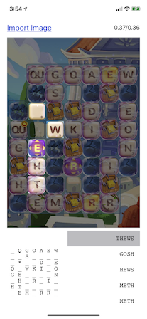
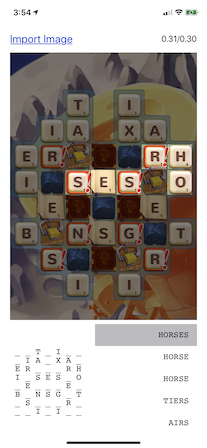
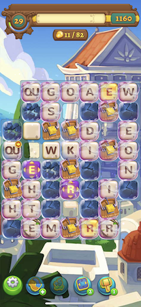

# alphabetty-solver

The app uses the most recent image (or a manually imported image) and finds all the words available, assuming the image is a screenshot of an AlphaBetty game.  Once the list of words is created, the user can either tap on a letter to see the words that use it or tap on a word and see where that word is on the board.

 

This project started as a small python script which I wrote to expand my OpenCV skills.  It uses OpenCV to find, recognize, and identify the letters on the board.

## Running the app
- You'll likely need an Apple Developer ID to build and run the app on a real device.
- You'll need to copy the OpenCV framework (version 4.1.1 or higher) to the root folder.  The framework can be downloaded [here](https://opencv.org/releases).

## Known limitations
- Does not detect the red borders around terminating tiles.
- Only works on portrait screenshots of the game.
- Only supports full-sized boards, specifically 7 by 8 tiles.
- The valid words are from a modified SCOWL list generated from [this site](http://app.aspel.net/create).  The word list does not perfectly match the one used by AlphaBetty and King does not indicate which word list used in AlphaBetty.

## Testing
Although the current product is an iOS app, the python script is still used in the development process as a quick way to test out features and fixes.  It also runs a series unit tests which consists of image & text pairs.  The test retrieves the letters from the current board and compare it to the respective text file.  For example, the following image is compared against the following text.

### Actual


### Expected
```
   Q G O A E W
     S        
   *     D   E
 Q   W K I   O
 G E         N
   H   R   I  
 H T          
   E M   R R  
```
   
Tests are available in the 'Test' folder and can be run with the following command: `python3 runtests.py 0`.
Note that only the smaller JPG test files are included.  The 20+ PNG file tests are 150MB and are not included.

## Disclaimer
This project is not affiliated, associated, authorized, endorsed by, or officially connected with King.com Limited or subsidiaries.  King.com Limited and AlphaBetty are probably trademarks or registered trademarks of King.com Limited
